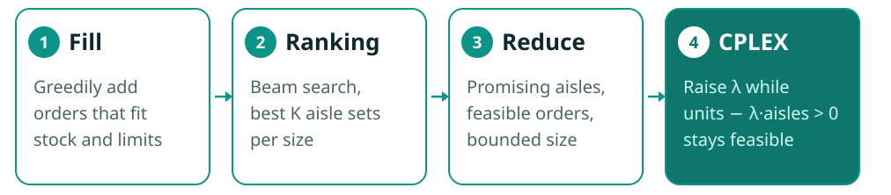

## The challenge

Mercado Libre, Latin America's largest e-commerce company, ran its **first optimization challenge** as part of
**SBPO 2025**, the 57th Brazilian Symposium on Operations Research. The problem came straight from their fulfillment
centers: **wave order picking**.

A warehouse has orders waiting and aisles holding stock. A *wave* is a batch of orders picked together. You choose
which orders go in the wave and which aisles the pickers visit, and you want as many units as possible per aisle visited:

> **maximize** units picked ÷ aisles visited
>
> **subject to:** every chosen order is picked in full · each item's demand fits the stock in the chosen aisles · the wave's total units stay between a lower and an upper bound

Solutions ran in Java under a hard **10-minute limit per instance**, on large real-world-shaped datasets.

## Why it's hard

- **The objective is a ratio.** Adding an aisle can raise or lower the score, so neither greedy choice nor a plain integer program solves it directly.
- **The search space is huge.** Every subset of aisles allows a different set of orders.
- **Time is strict.** A full integer program over every aisle and order doesn't converge in 10 minutes on the big instances. Exceeding the limit or returning an infeasible wave scores nothing.

## My approach: COMBO

A pipeline where fast heuristics find good regions of the search space and CPLEX does exact work only inside them.

1. **Fill.** Given a set of aisles, greedily add orders while stock and the wave-size bound allow. Fast enough to run thousands of times.
2. **Ranking.** A beam search over aisle sets grouped by size: for each number of aisles, keep the best *K* sets found so far, extend each one by every aisle, fill, and re-rank. *K* is calibrated at runtime by timing a few iterations, so the search fits its time budget on any instance.
3. **Reduce.** Build the integer program using only the aisles that appear in the top-ranked sets of the most promising sizes, drop orders that can't possibly be served, and bound the number of aisles.
4. **CPLEX ratio search.** Instead of optimizing a ratio, ask CPLEX for a feasible wave with units − λ·aisles > 0, where λ is the best ratio so far. Each success raises λ and tightens the maximum number of aisles, in the spirit of Dinkelbach's method for fractional programs. CPLEX first runs with each top aisle set fixed, then on the reduced model, and on the full model if more than 100 seconds remain.

A safety margin before the 10-minute limit guarantees a valid answer is always returned.

## Result

> **First place** in the final ranking, awarded with a medal at SBPO 2025 in Gramado, Brazil.

<!-- TODO: final score or margin over second place; what you would improve with more time. -->
