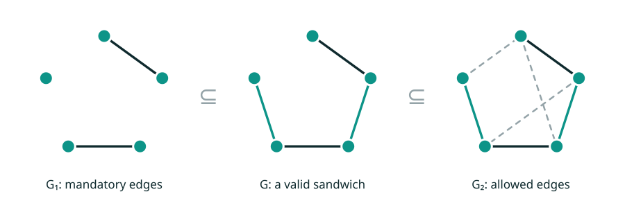
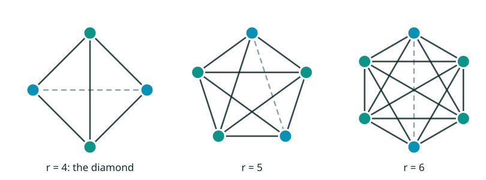

## The thesis

This is the thesis for my **BS + MS in Computer Science at the University of Buenos Aires (UBA)**,
directed by **Min Chih Lin**. The results are published as a paper on arXiv, co-authored with him:

> **An Arboricity-Sensitive Algorithm for the Kr−e-Free Graph Sandwich Problem**
> Min Chih Lin, Natán Vekselman. arXiv:2609.23458, 2026. Data Structures and Algorithms (cs.DS), Discrete Mathematics (cs.DM).

The thesis itself is written in Spanish: *Un Algoritmo Eficiente para el Problema Kr−e-free Sandwich en Grafos*.

## The problem

In a **graph sandwich problem** you get two graphs on the same vertices. G₁ holds the edges you **must** keep,
and G₂ holds every edge you're **allowed** to use. The question: is there a graph G "sandwiched" between them,
containing all of G₁ and only edges from G₂, that has a given property?

*Mandatory edges in dark, chosen optional edges in teal, unused allowed edges dashed.*

Here the property is being **Kr−e-free**: G must not contain, as an induced subgraph, a complete graph
on r vertices with exactly one edge removed. For r = 4 that forbidden shape is the **diamond**.

*The forbidden subgraphs Kr−e for r = 4, 5, 6. The dashed line is the one missing edge.*

## The key idea: arboricity

The **arboricity** α of a graph is the smallest number of forests its edges can be split into. Sparse graphs,
such as planar graphs and most real-world networks, have small arboricity even when they have many vertices.
The cover image above shows a graph whose edges split into three forests, one per color.

Our algorithm's running time depends on α rather than only on the number of vertices. On sparse inputs this turns
a high-degree polynomial into something close to linear.

## Contributions

- A **deterministic algorithm** for the Kr−e-free sandwich problem, for any fixed r ≥ 4, running in
  **O(n + α(G₂)r−3·m₂)** time and space, where m₂ is the number of edges of G₂.
- For the **diamond-free** case (r = 4) this becomes **O(n + α(G₂)·m₂)**.
- Both improve on the previous **O(nr·m₂)** approach.
- The implementation organizes the search around **components indexed by (r−3)-cliques**, with a filtered frontier
  that keeps the work proportional to the relevant part of the graph.
- Applied to **probe Kr−e-free recognition**, the method runs in **O(nr−1)** time, improving on the
  earlier O(nr+2) bound.
- The same local characterization also yields a **static recognizer** for Kr−e-free graphs.

<!-- TODO: a one-paragraph intuition of the local characterization, in your own words. -->

> Status: the paper is on arXiv; the thesis defense is expected by December 2026.
